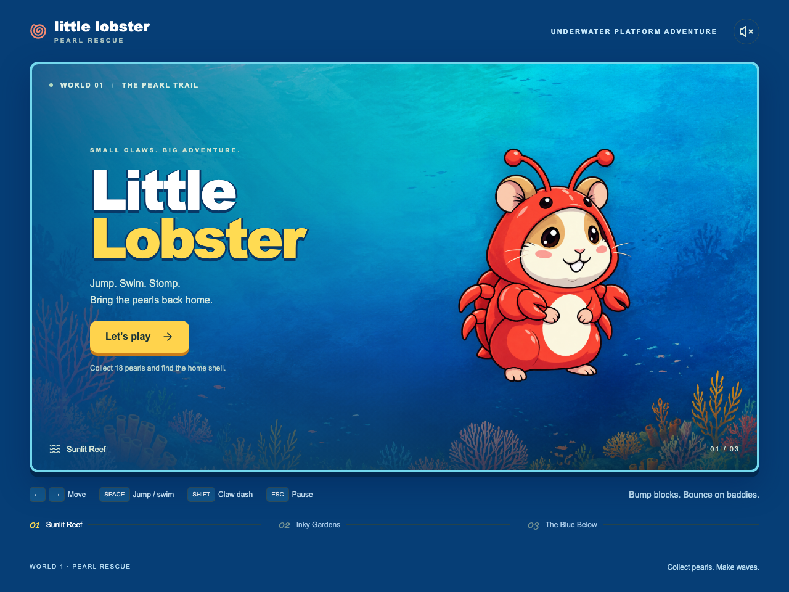

# Little Lobster

[](https://github.com/alexanderop/little-lobster/actions/workflows/quality.yml)

A Vue 3 and Phaser 3 browser adventure. Collect 18 pearls, bump golden blocks, stomp smaller enemies, meet a narwhal, and reach the home shell.



## Run locally

Use Node 24 and pnpm 10.28.2, pinned in `package.json`.

```sh
pnpm install --frozen-lockfile
pnpm dev
```

Open the URL printed by Vite. Arrow keys or A/D move, Space or W jumps/swims, Down or S sinks, Shift or X dashes, and Escape or P pauses. Touch controls appear on touch devices. Sound starts muted.

## Verify changes

Install Chromium once:

```sh
pnpm exec playwright install chromium
```

Run the complete quality gate:

```sh
pnpm check
```

This checks formatting, Oxlint rules, Vue template lint, TypeScript, Vitest tests, the production build, and desktop/mobile application tests. CI runs the same command on macOS to match the checked-in screenshot baselines. Branch protection must require the Quality job to enforce it before merging.

For a focused check:

```sh
pnpm test:unit
pnpm test:browser
pnpm build && pnpm test:e2e
```

- Node tests exercise the actual simulation, including the complete pearl trail, block rewards, stomps, jump height, cooldowns, checkpoints, and the win boundary. Input tests cover overlapping keyboard and pointer sources.
- Vitest Browser Mode uses Chromium and real Phaser scenes/assets. It covers sprite updates, pause, restart, game destruction, and the mounted Vue interface.
- Playwright tests the built app, including keyboard and touch controls, menu focus, loading failures, retry, score persistence, and desktop/mobile welcome screenshots. Mobile tests emulate touch in Chromium; they do not prove iOS Safari behavior.

After an intentional visual change, run `pnpm exec playwright test --update-snapshots` on macOS and inspect the changed images before committing them. Other operating systems need their own reviewed screenshot baselines. Browser failure traces and screenshots are saved under `test-results/`.

Oxlint performs type-aware linting. `vue-tsc` owns type checking, including Vue single-file components. ESLint checks Vue template rules. Use `pnpm format` to format maintained source and tests; original artwork and asset-generation scripts are excluded.

## Game structure

See [the architecture guide](./ARCHITECTURE.md) for ownership, Phaser lifecycle, and where to put new behavior.

Only the best completed pearl count is saved locally. A page reload starts a new run. Checkpoints, collected pearls, and used blocks survive retries within that run. Starting over resets the run and its visual effects.

The optional WebMCP tools `read_game_state` and `set_game_paused` register after Phaser is ready when the browser supports `document.modelContext`. Ordinary gameplay does not require that API.

## Build and hosting

`pnpm build` produces a static site in `dist/`. `pnpm start` previews that build locally. `.openai/hosting.json` retains the existing Sites project and points to the static output; the game needs no server bindings.

[Asset sources and generation prompts](./ART.md)
